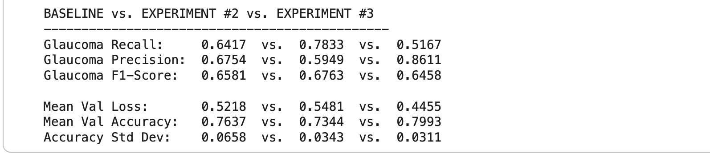
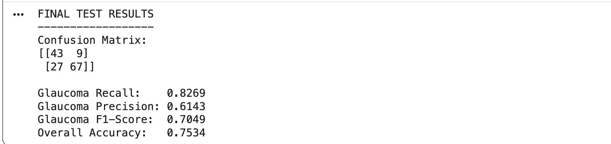

# Glaucoma Detection from Retinal Fundus Images Using Deep Learning

## One-Sentence Description
A computer vision project using transfer learning with ResNet50 to classify retinal fundus images as glaucoma or normal, with an emphasis on reducing missed glaucoma cases rather than maximizing overall accuracy.

## Project Overview
This project explores whether a computer vision model can identify retinal fundus images showing signs associated with glaucoma. I chose this problem because glaucoma has affected my family personally, giving me a strong interest in exploring how machine learning and computer vision can be applied to retinal-image analysis. The project uses transfer learning with a pre-trained ResNet50 and compares multiple experimental approaches, with glaucoma recall prioritized because reducing missed glaucoma cases was more important to the project objective than maximizing overall accuracy.

## Research Question / Objective
Can a computer vision model identify retinal fundus images that show signs associated with glaucoma?

The objective was not to maximize accuracy alone. Because missing a glaucoma image was considered more consequential to the project's goal than incorrectly flagging a normal image, glaucoma recall (sensitivity) was treated as the primary model-selection priority. Overall accuracy, precision, F1-score, validation loss, and the confusion matrix were also evaluated to provide a broader view of model performance.

## Dataset
This project used the RIM-ONE DL retinal fundus image dataset, containing 485 images: 313 normal and 172 glaucoma.

The provided random partition was used to separate the data into:

* Development set: 339 images — 219 normal and 120 glaucoma
* Untouched test set: 146 images — 94 normal and 52 glaucoma

The test set was kept separate throughout model development and was evaluated only after the final model-selection decision. Within the 339-image development set, 5-fold stratified cross-validation was used to compare the experimental approaches. This allowed each development image to serve as validation data once while preserving the untouched test set for final evaluation.

Because the dataset was relatively small and contained more normal than glaucoma images, class imbalance was considered during the experimental phase.

## Methodology
### Model Architecture
The project used a ResNet50 model pre-trained on ImageNet as the foundation for transfer learning. For the baseline and class-weighted experiments, the pre-trained backbone parameters were frozen and the original classification layer was replaced with a new fully connected layer for two-class classification: glaucoma and normal.

### Image Preprocessing and Augmentation
Retinal images were resized to 224 × 224 pixels and normalized using the standard ImageNet normalization values associated with the pre-trained model. Training images used limited data augmentation, including random horizontal flipping and small brightness/contrast adjustments. Validation and test images were not augmented.

### Training Approach
Models were trained using cross-entropy loss and the Adam optimizer. The baseline used the original class distribution, while Experiment #2 introduced class-weighted cross-entropy loss to give greater weight to the underrepresented glaucoma class. Experiment #3 tested partial fine-tuning by unfreezing the final ResNet50 block (Layer4) along with the classification layer.

### Cross-Validation
Each experimental approach was evaluated using the same 5-fold stratified cross-validation framework within the 339-image development set. A fresh model and optimizer were created for each fold so that training from one fold did not carry over into the next.

## Experiments
### Baseline — Frozen ResNet50
Established a reference point using the pre-trained ResNet50 backbone with its parameters frozen and a new two-class classification layer.

### Experiment #2 — Class-Weighted Loss
Tested whether giving greater weight to the underrepresented glaucoma class could improve glaucoma detection. Class weights were calculated independently within each cross-validation fold using only that fold's training subset.

### Experiment #3 — Partial Fine-Tuning
Tested whether allowing the final ResNet50 block (Layer4) to adapt to the retinal images could improve performance while keeping the earlier layers frozen.

## Model Selection
Model-selection conclusion: Experiment #2 (class weighting) was selected for final evaluation because it achieved the highest glaucoma recall (78.33%) across the validation predictions. Although its mean validation accuracy (73.44%) was lower than the baseline (76.37%) and partial fine-tuning experiment (79.93%), the project prioritized reducing missed glaucoma cases rather than maximizing overall accuracy.

## Final Test Results
After Experiment #2 was selected, a final class-weighted ResNet50 model was trained using all 339 development images and evaluated once on the previously untouched 146-image test set.

- **Glaucoma Recall / Sensitivity:** 82.69%
- **Glaucoma Precision:** 61.43%
- **Glaucoma F1-Score:** 70.49%
- **Overall Accuracy:** 75.34%
- **Glaucoma correctly detected:** 43 of 52
- **Glaucoma missed:** 9 of 52
- **Normal correctly identified:** 67 of 94
- **Normal incorrectly flagged as glaucoma:** 27 of 94

The final model detected a substantial majority of the glaucoma images in the test set, while producing more false-positive glaucoma predictions as a tradeoff for prioritizing glaucoma detection.

## Key Takeaway
The experiment with the highest overall validation accuracy was not the experiment selected for final evaluation. Partial fine-tuning achieved the highest mean validation accuracy at 79.93%, but its glaucoma recall was only 51.67%. Class weighting produced a lower mean validation accuracy of 73.44% but substantially higher glaucoma recall of 78.33%. Because the project prioritized reducing missed glaucoma cases, the class-weighted approach was selected.

The central lesson: model selection should reflect the project's objective, not accuracy alone.

## Limitations
- **Missed glaucoma cases:** The final model missed 9 of 52 glaucoma images in the untouched test set. Although sensitivity was 82.69%, false negatives remained an important limitation given the project's emphasis on reducing missed glaucoma cases.
- **False-positive glaucoma predictions:** The model incorrectly classified 27 of 94 normal images as glaucoma, demonstrating the tradeoff associated with prioritizing glaucoma detection.
- **Relatively small dataset:** The project used 485 retinal images, limiting how broadly the results can be generalized to a larger and more diverse population of retinal images.
- **Single dataset source:** All images came from RIM-ONE DL. Although the test set was kept untouched during model development, it came from the same dataset, so the results do not establish performance on retinal images from other datasets or sources.

## Future Improvements
- **Larger and more diverse dataset:** Evaluate the approach using a larger, high-quality, and more diverse retinal-image dataset to provide stronger evidence about how well the model generalizes across a broader range of images.
- **Compare pre-trained architectures:** Compare ResNet50 with other pre-trained architectures to determine whether a different architecture may be better suited to the retinal-image classification task.
- **External validation:** Evaluate the completed model on retinal images from a dataset other than RIM-ONE DL to assess whether its performance generalizes to images from a different source.

## Technologies & Techniques Used
- Python
- PyTorch
- torchvision
- scikit-learn
- NumPy
- Google Colab
- ResNet50 / Transfer Learning
